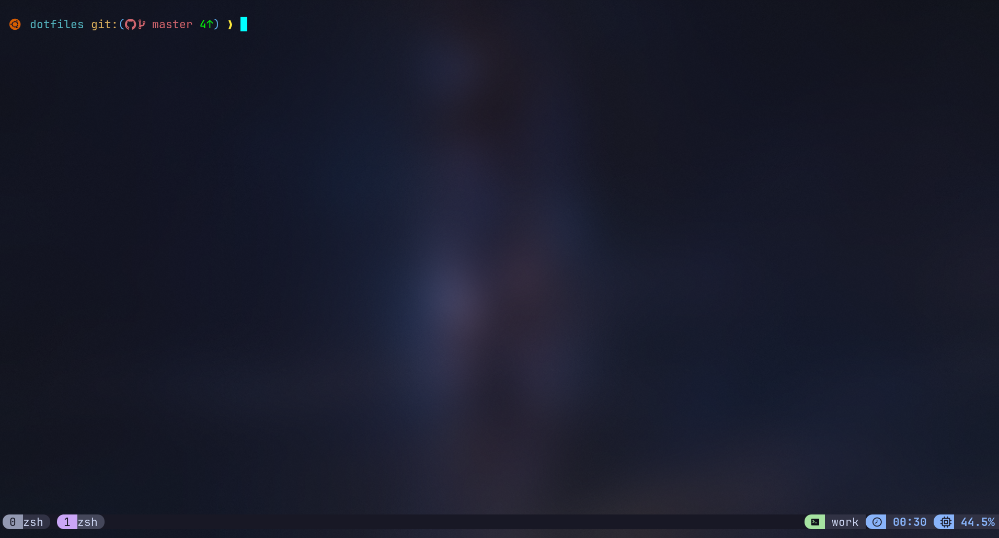

# dotfiles

> My personal terminal configuration — tmux + Oh My Posh custom theme.



---

## Structure

```
dotfiles/
├── assets/
│   └── img/
│       └── demo.png
├── ghostty-config/
│   ├── config.ghostty
│   └── shaders/
│       └── cursor_trail.glsl
├── oh-my-posh/
│   └── custom_bash_master.omp.json
└── tmux/
    └── tmux.conf
```

---

## Tmux

**File:** `tmux/tmux.conf`

A minimal tmux config focused on a clean status bar, sane keybindings, and a dark color scheme that pairs with the Oh My Posh theme.

### Install

```bash
ln -sf ~/dotfiles/tmux/tmux.conf ~/.tmux.conf
tmux source-file ~/.tmux.conf
```

---

## Oh My Posh

**File:** `oh-my-posh/custom_bash_master.omp.json`

A custom prompt theme showing the current directory, git branch, and git status — built for Bash.

### Requirements

- [Oh My Posh](https://ohmyposh.dev/) `>= 20.x`
- A [Nerd Font](https://www.nerdfonts.com/) (theme uses glyphs)

### Install

```bash
# Install Oh My Posh
curl -s https://ohmyposh.dev/install.sh | bash -s

# Add to ~/.bashrc
eval "$(oh-my-posh init bash --config ~/dotfiles/oh-my-posh/custom_bash_master.omp.json)"

# Reload shell
source ~/.bashrc
```

---

## Requirements

| Tool                                 | Version   |
| ------------------------------------ | --------- |
| [tmux](https://github.com/tmux/tmux) | `>= 3.2`  |
| [Oh My Posh](https://ohmyposh.dev/)  | `>= 20.x` |
| Nerd Font                            | any       |

---

## Ghostty + Cursor Trail ✨

If you're looking for a faster, more modern terminal — give [Ghostty](https://ghostty.org/) a try.
This repo includes a ready-to-use config with a **cursor trail shader** that adds a smooth trailing effect to your cursor as it moves.

**Files:**

- `ghostty-config/config.ghostty` — main Ghostty config
- `ghostty-config/shaders/cursor_trail.glsl` — custom GLSL cursor trail shader

### Install

```bash
# Symlink the Ghostty config
mkdir -p ~/.config/ghostty
ln -sf ~/dotfiles/ghostty-config/config.ghostty ~/.config/ghostty/config

# Copy the shader to Ghostty's shaders directory
mkdir -p ~/.config/ghostty/shaders
ln -sf ~/dotfiles/ghostty-config/shaders/cursor_trail.glsl ~/.config/ghostty/shaders/cursor_trail.glsl
```

Then restart Ghostty — the cursor trail will be active automatically.

> [!NOTE]
> Ghostty supports custom GLSL shaders natively. No plugins needed.

---

## Neovim

> Coming soon...

## License

MIT
